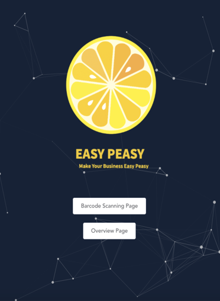
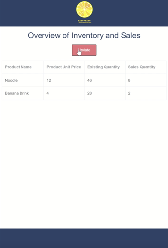

# Easy Peasy Prototype

This is the prototype for Easy Peasy APP, an innovative software aims to empower and streamline inventory management in micro-to-small grocery shops. This prototype includes three main pages:

1. Home Page
2. Scanning and Recording Inventory 
3. Overview of the inventory

# Prerequisite 

You must have these package /tools installed on your local machine before implementing the prototype:

- Python == 3.7.7

- Pip

  - This is used to install the required package for this project. You can check using 

    ```
    pip --version
    ```

  - If not installed, type following command to install

    ```
    python -m pip install
    ```

- the packages inside the **requirements.txt**

  - Please follow the steps in the **Start Guides** to correctly install these packages

# Start Guides

Clone this repo to your local machine by running

```
git clone https://github.com/lucyli0609/TIP.git
```

## Start the Emulators

The following steps is used to start the Emulators.

### Barcode Emulator

1.  Use Terminal in Mac/Linux/Unix or PowerShell in Windows
2.  Navigate to the repo folder and run. This will guide to the Emulators folder.

```
cd Emulators
```

2. Start the barcode emulator by typing the following command

```python
python barcode_db.py
```

You should be able to see following command in your terminal if it is successful:

> Listening at 9000

### Pos Emulator

1. Use Terminal in Mac/Linux/Unix or PowerShell in Windows
2. Navigate to the repo folder and run. This will guide to the Emulators folder.

```
cd Emulators
```

3. Start the Pos emulator by typing the following command

```python
python pos_sys.py
```

You should be able to see following command in your terminal if it is successful:

> Listening at 9002

## Start the Server and website

1. Use Terminal in Mac/Linux/Unix or PowerShell in Windows

2. Navigate to the repo folder

3. Run following command. This will guide you to the prototype folder under the repo folder

   ```
   cd prototype
   ```

   You should be able to see **requirements.txt** under this folder by typing:

   - For Mac

     ```
     ls
     ```

   - For Windows

     ```
     dir
     ```

4. Install the required package using pip

   ```python
   pip install -r requirements.txt
   ```

5. You can start the server using following command:

   ```python
   python manage.py runserver
   ```

You should be able to see following command in your terminal if it is successful:

> Performing system checks...
>
> System check identified no issues (0 silenced).
>
> You have 15 unapplied migration(s). Your project may not work properly until you apply the migrations for app(s): admin, auth, contenttypes, sessions.
> Run 'python manage.py migrate' to apply them.
> June 07, 2020 - 16:15:49
> Django version 2.1.4, using settings 'prototype.settings'
> Starting development server at http://127.0.0.1:8000/
> Quit the server with CTRL-BREAK.

Now you can access the home page  http://127.0.0.1:8000/

# Structure of Prototype Folder

A brief structure of our prototype is shown below:

```
└─TIP
    ├─.idea
    │
    ├─ venv
    │
    ├─ barcode_pictures
    │      
    ├─Emulators
    │      barcode_db.py
    │      data.json
    │      pos_sys.py
    │      sales.json
    │      testclient.py
    │      
    ├─prototype
    │  │  db.sqlite3
    │  │  manage.py
    │  │  requirements.txt
    │  │  
    │  ├─frontend
    │  │  
    │  │ 
    │  │ 
    │  ├─myapp
    │  │ database.json
    │  │ 
    │  ├─prototype
```


# Functions Overview

## Home Page 

### Address

http://127.0.0.1:8000/

### Website Page


### Instructions

Simply click the two buttons to visit our two main functions.

## Barcode Scanning Page

### Address

http://127.0.0.1:8000/#/scan

### Website Page


### Instructions

1. To scan the picture, please click the + on the top

2. Upload the picture in the barcode barcode_picture folder in the repo folder(refers to the following structure to see the barcode_picture folder position)

   ```
   └─TIP
       ├─.idea
       │
       ├─ venv
       │
       ├─ barcode_pictures
       │      
       ├─ Emulators
       │      
       ├─ prototype 
   ```

3. Click the upload *Search Barcode*  **on the picture**. (Not the Search your barcode green button)
   - You should see the barcode number auto filled
4. Click green button *Search your barcode*
5. You should see all the other material is auto filled
6. Enter quantity (and supplier details if it is a new product) 
7. click  *Create*
   - You should see the page prompt a message saying updated successfully
8. Try the two pictures I provide in the folder. Aware that, once you scan the picture, it will be inside the database, it will not ask the barcode system. 
9. You can go back to the home page by clicking back or enter the home page address

## Overview Page

### Address

http://127.0.0.1:8000/#/FirstPage

### Website Page



### Instructions

1. click the update button, you will get the updated information

Noted that there are only two types of product will be updated by the pos emulator:

- Noodle
- Banana Drink

# Database

- You can access the database for this app under the myapp folder, called *database.json*. (refer to the **Structure of Prototype Folder**)

- You  can access the database for the barcode under the Emulators folder , called *data.json*
- You can access the database for the sales data under the Emulators folder , called *sales.json*

# Contact Information

If there is any other issue please email for tech support:

ningjingw@student.unimelb.edu.au 

